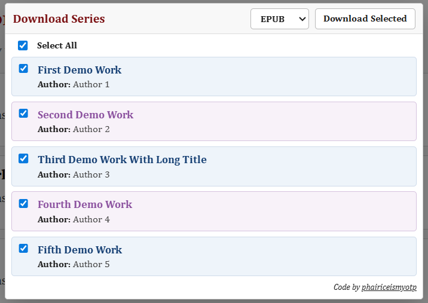

# AO3 Bulk Downloader Bookmarklet

AO3 Bulk Downloader Bookmarklet is a small browser bookmarklet project for downloading multiple Archive of Our Own works from AO3 series and bookmarks pages.

The project is unofficial and is not affiliated with Archive of Our Own, the Organization for Transformative Works, or any browser vendor.

## Video tutorial

[Watch the step-by-step installation guide on YouTube](https://www.youtube.com/watch?v=JMhbrHCpe68)

The tutorial uses real AO3 data for an objective demonstration:

- Work
  + Work 1: [And thus I choose you, my only universe](https://archiveofourown.org/works/67745956)
  + Work 2: [From You, A Whisper of Hope](https://archiveofourown.org/works/68383601/chapters/176976881)
- Series: [The Death and the Pale Dawn](https://archiveofourown.org/series/4966846)
- Author: [VanToRia](https://archiveofourown.org/users/VanToRia/pseuds/VanToRia)

The referenced work, author profile, and series belong to their respective AO3 creator.

## Important note

The bookmarklet intentionally waits `10` seconds between queued downloads. This delay helps avoid sending too many AO3 download requests at once, which may look like suspicious traffic and trigger AO3's Cloudflare protection.

Reducing this delay is not recommended unless you understand the risk.

## Screenshots

Screenshots use fictional demo data for display purposes only. They do not imply endorsement by AO3, OTW, or any work creator.

<p align="center">
  
</p>

## Features

- Bulk download works from AO3 series pages.
- Bulk download works from AO3 bookmarks pages.
- Supports `EPUB`, `AZW3`, `MOBI`, `PDF`, and `HTML`.
- Select all, individual selection, and shift-click range selection.
- Queue downloads with a delay between files.
- Stop pending queued downloads.
- Close the UI without stopping the active queue.
- Compact AO3-style card UI with alternating blue-purple rows.
- Uses AO3 download URLs directly instead of fetching, proxying, or rehosting files.

## Files

- `AO3BulkDownloader.js` - readable bookmarklet source.
- `scripts/build-bookmarklet.js` - dependency-free build script.
- `dist/AO3BulkDownloader.bookmarklet.txt` - generated raw bookmarklet.
- `dist/AO3BulkDownloader.bookmarklet.encoded.txt` - generated encoded bookmarklet.
- `AI_AUDIT_GUIDE.md` - suggested checklist and prompt for independent AI review.
- `PRIVACY.md` - privacy and disclaimer notes.
- `NOTICE.md` - license notice and attribution.
- `package.json` - build command.

## How it works

`AO3BulkDownloader.js` runs on AO3 series and bookmarks pages.

It reads the works already present in the current page HTML, extracts each work ID and title, builds AO3 download URLs, and opens each selected download through a temporary hidden link.

Downloads are queued with a delay between each file. The delay keeps the bookmarklet from firing every selected download at once and gives the browser a better chance to handle multiple files cleanly.

For AO3 download routes, the bookmarklet follows AO3's filename slug style as closely as possible. When a title cannot produce an ASCII-like slug, the bookmarklet uses a minimal `work` route placeholder and lets AO3 return the final filename.

The bookmarklet does not download works through a third-party service. It only asks the browser to open AO3 download URLs from the current AO3 page.

## Supported pages

- AO3 series pages such as `/series/12345678`
- AO3 bookmarks pages such as `/users/name/bookmarks`

Individual AO3 work pages already include official download buttons, so this bookmarklet is intended for pages where AO3 does not provide bulk download controls.

## Build

This project uses Node.js only to build the bookmarklet text files.

There are no runtime dependencies and no npm packages to install.

```bash
npm run build
```

The build script generates:

```text
dist/AO3BulkDownloader.bookmarklet.txt
dist/AO3BulkDownloader.bookmarklet.encoded.txt
```

The repository may already include generated bookmarklet files in `dist/`. Users can use the provided bookmarklet directly, but reviewing the readable source and rebuilding it locally is recommended.

The raw bookmarklet is easier to inspect. The encoded bookmarklet is more URL-safe.

## Installation

1. Download the full repository as a ZIP file from GitHub, then extract it.
2. Review `AO3BulkDownloader.js`.
3. Use the provided `dist/AO3BulkDownloader.bookmarklet.txt`, or install Node.js and run `npm run build` in the extracted project folder to generate it yourself.
4. Press `Ctrl + Shift + B` to show the browser bookmarks bar.
5. Right-click the bookmarks bar, choose `Add page...`, then name it something clear, such as `AO3 Bulk Downloader`.
6. Paste the contents of one `*.bookmarklet.txt` file into the bookmark URL field.
7. Open an AO3 series or bookmarks page.
8. Click the bookmarklet.
9. Select works and format.
10. Click `Download Selected`.

Your browser may ask for permission to allow multiple downloads from AO3.

## Configuration

The main configuration values are inside `AO3BulkDownloader.js`.

- `QUEUE_DELAY`: Delay between queued downloads.
- `LINK_CLEANUP_DELAY`: Time before temporary download links are removed from the page.
- `MAX_VISIBLE_CARDS`: Maximum number of cards shown before the UI scrolls.
- `AO3_SLUG_LIMIT`: AO3-style slug length used for download URLs.
- `FORMATS`: Download formats shown in the format selector.
- `CONFIG.font`: Bookmarklet UI font.
- `CONFIG.creditUrl`: Credit link shown in the UI.

After changing configuration, run `npm run build` again.

## Privacy

This project is designed to run entirely in the user's browser on AO3 pages.

The author does not receive AO3 usernames, bookmark data, work data, downloaded files, browser history, or any other personal information.

During normal download use, the bookmarklet opens only AO3 download URLs created from the current AO3 page. The UI also includes a credit link to GitHub, but that link is not requested unless the user clicks it.

Before installing, users are encouraged to review the readable source code and build the bookmarklet themselves.

## Limitations

- The bookmarklet only sees works present in the current page HTML.
- Paginated AO3 pages must be handled page by page.
- Download filenames are ultimately controlled by AO3 and the browser.
- Browser multiple-download protection may require user approval.

## Acknowledgements

This project was inspired by PhaiRice, the Phainon x Castorice pairing from Honkai: Star Rail (miHoYo). They are the reason behind the name `phairiceismyotp` and the blue-purple alternating theme in the Tampermonkey interface.

The bookmarklet concept was also inspired by Flamebyrd's [AO3 Ebook Download Helper / AO3 Downloader](https://random.fangirling.net/scripts/ao3_downloader/).

My deepest thanks go to the friends and beta testers from the PhaiRice shipper community. Your support, testing, and suggestions helped shape this project from a small personal tool into something worth sharing.

Thank you, sincerely.

## License

AO3 Bulk Downloader Bookmarklet is licensed under AGPL-3.0-only. See `LICENSE` for the full license text.

Copyright (c) 2026 phairiceismyotp (or3zz - Nguyen Tin)
